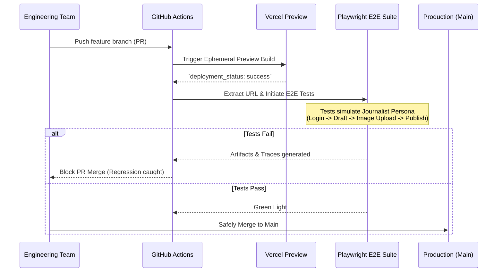

# InshortBD: Cloud-Native Editorial CI/CD

> A deeply resilient, heavily automated newsroom platform built to eliminate downtime entirely while scaling instantly for 170 million Bengali speakers.

## 📖 The Architectural Context

In the digital news sector, downtime during a major geopolitical event is a catastrophic business failure. The challenge with **InshortBD** was two-fold:
1. **The Infrastructure Must Scale:** Handle violent, sporadic traffic spikes that typically crash traditional monolithic CMS architectures.
2. **The Deployment Must Not Fail:** Allow an engineering team to ship continuous iterative updates without *ever* breaking the complex WYSIWYG editor workflows relied upon by non-technical journalists.

The solution was discarding legacy infrastructure in favor of a **Cloud-Native DevSecOps Pipeline**.

---

## 🏗️ The CI/CD Pipeline Architecture

This repository operates on a strict zero-production-escape policy powered by Vercel and Playwright.



---

## 🚀 Core Engineering Implementations

### 1. Frictionless Tiptap CMS
Journalists lose critical time wrestling with inflexible text editors.
*   **Custom Block Logic:** Engineered custom Tiptap extensions allowing editors to natively embed complex components (Twitter payloads, YouTube iframes, intricate tables) through simple slash-commands.
*   **Optimistic Publishing:** Draft states are autosaved locally and synced asynchronously to prevent data loss during network interruptions.

### 2. AWS S3 Asset Offloading Pipeline
Handling heavy media uploads (high-res photography, raw video snippets) typically bottlenecks main application servers.
*   **Presigned Uploads:** The Next.js server acts only as an authenticator. It generates a temporary, cryptographically secure AWS S3 presigned URL.
*   **Direct to Bucket:** The journalist's browser streams the heavy file *directly* to S3, totally bypassing the Next.js infrastructure and insulating the database from I/O starvation.

### 3. Absolute QA Automation
The Playwright suite does not just test code; it tests the business model. The E2E suite logs into a staging environment, executes complex DOM manipulations exactly as a human editor would, verifies the exact database insertions, and validates final visual layouts before *any* code reaches production.

## 🛠️ Technical Stack

*   **Frontend Ecosystem:** Next.js 14, React, Tailwind CSS
*   **Media Pipeline:** AWS S3, AWS CloudFront CDN
*   **Editorial Interface:** Tiptap Editor Core
*   **DevSecOps Automation:** GitHub Actions, Playwright
*   **Deployment:** Vercel

---

## 🚦 Local Setup & Testing Validation

1.  **Clone the Repository**
    ```bash
    git clone https://github.com/Afraim3499/inshortbd.git
    cd inshortbd
    npm install
    ```

2.  **Initialize the E2E Environment**
    Next.js applications being tested by Playwright require specific binaries:
    ```bash
    npx playwright install --with-deps
    ```

3.  **Define Environment Blocks**
    In `.env.local`:
    ```env
    AWS_ACCESS_KEY_ID=your_key
    AWS_SECRET_ACCESS_KEY=your_secret
    AWS_REGION=your_region
    AWS_S3_BUCKET_NAME=your_bucket
    ```

4.  **Execute the Test Pipeline Locally**
    Validate the core infrastructure workflows on your machine:
    ```bash
    npx playwright test --ui
    ```

## 👤 Lead Architect
**Rizwanul Islam (Afraim)**  
*Your Vision Is Chaos. I Architect It Into Profit.*  
[View Portfolio](https://www.rizwanulafraim.com/)
